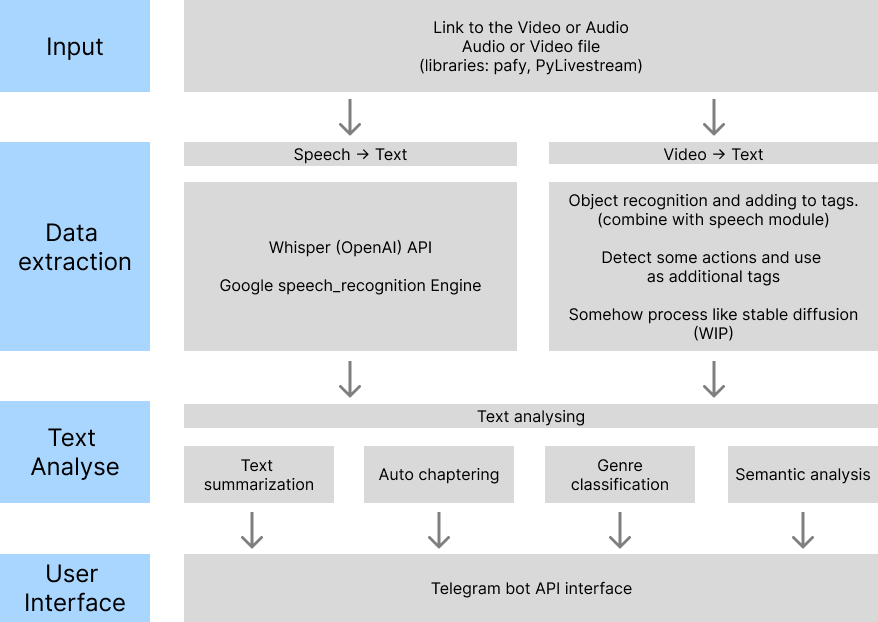

# Stream Captions extract engines

Project that assumes methods for extraction captions and create text resume from speech video/audio stream input

## Roadmap:

### Relevant links

*Load Video Stream as an object*

[pafi](https://pypi.org/project/pafy/)

[PyLivestream](https://pypi.org/project/pylivestream/)

[stackoverflow opencv pafi example](https://stackoverflow.com/questions/37555195/is-it-possible-to-stream-video-from-https-e-g-youtube-into-python-with-ope)

*SOTA relevant experience*

[AssemplyAI Video AutoChapters](https://www.assemblyai.com/blog/introducing-assemblyai-auto-chapters-summarize-audio-and-video-files/)

[Whisper OpenAI blog](https://openai.com/blog/whisper/)

*Speech recognition*

[speech recognition package](https://www.thepythoncode.com/article/using-speech-recognition-to-convert-speech-to-text-python)

*Text processing*

[Text Summarization approaches](https://www.machinelearningplus.com/nlp/text-summarization-approaches-nlp-example/)
[Text Summarization apperoaches 2] (https://github.com/icoxfog417/awesome-text-summarization)

### Datasets

[Voice Datasets Compilation](https://github.com/jim-schwoebel/voice_datasets)

[Russian Open Text To Speech (TTS) Dataset](https://github.com/snakers4/open_stt/)

[Golos dataset](https://github.com/sberdevices/golos)

[Speech dataset RU](https://github.com/zpoken/Speech-Dataset-RU)

[About RU datasets on habr](https://habr.com/ru/post/450760/)

### Other links

[People's Speech Data Pipelines](https://github.com/mlcommons/peoples-speech#automatic-speech-recognition)

[arxiv People's Speech Dataset Description](https://arxiv.org/pdf/2111.09344.pdf)

[Image to text sota example Clip Interrogator](https://github.com/pharmapsychotic/clip-interrogator)

[habr Text Summarization approach](https://habr.com/ru/post/514540/)
